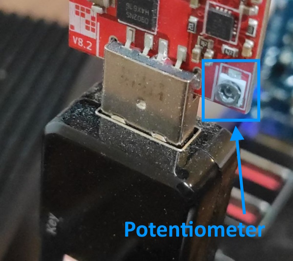
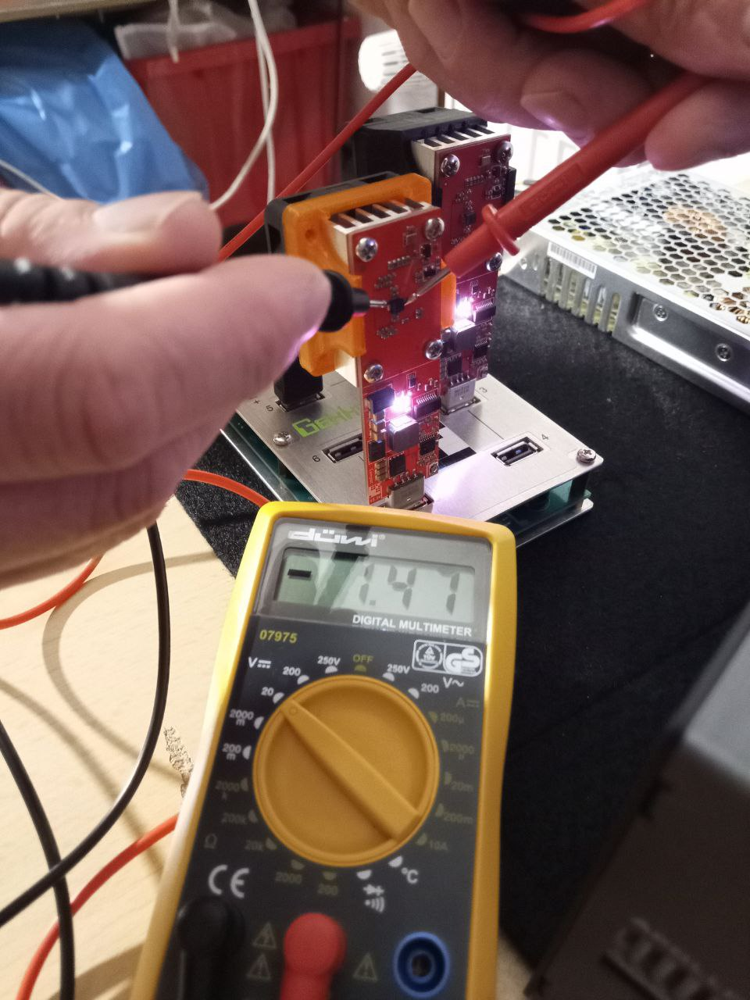

# 🌩 Übertakten

## The fun part

<!-- > :warning: **Warning:** Do not push the big red button.  -->

<!-- > :memo: **Note:** Sunrises are beautiful.  -->

<!-- > :bulb: **Tip:** Remember to appreciate the little things in life.  -->

> :warning: **WARNING**: Overclocking results in a higher power consumption. It is strongly recommended to think about a suitable cooling concept **before**, because you run the risk of damaging the chip **permanently**. I don't advise anyone to tune the system, especially since the added value is relatively low.

A small suggestion for sufficient cooling:

<table><tr><td></td><td></td><td></td></tr></table>

A CPU cooler with heatpipes was installed instead of the standard heatsink. Be sure to use thermal paste for optimal heat dissipation.

The standard voltage is 1.45V. The following values can be read from the description of the **Gekkoscience Compaq F** USB Miner as a guide:

| Frequency (MHz)        | 400  | 500  | 545  | 600  | 700  | 800  |
| ---------------------- | ---- | ---- | ---- | ---- | ---- | ---- |
| USB Hub Power (Ampere) | 2.00 | 2.75 | 3.00 | 3.30 | 4.00 | 5.00 |
| Hash Speed (GH/s)      | 200  | 300  | 366  | 400  | 460  | 550  |

> **Note:** The higher the hashrate the greater the deviation from the average, due to manufacturing tolerances of the ASIC.

Voltage can be adjusted at the potentiometer and measured as follows:

<figure><figcaption>Picture of Potentiometer</figcaption></figure>

The setting on the potentiometer should be verified immediately with a multimeter. 

<figure><figcaption>Image of the voltage tap</figcaption></figure>

<figure><figcaption>Image 2 of the voltage tap</figcaption></figure>

For the actual overclocking, the core voltage can now be increased from the standard 1.45V by turning the potentiometer. Basically, the increase should be done in tiny steps with a subsequent check if the cooling is still sufficient and if the mining is still stable.

The stability can be easily checked by **cgminer** and the already mentioned auto-tuning parameter. If necessary, the auto-tuning automatically lowers the frequency.

Checking the cooling is already a bigger challenge here. Ideally, this can be checked using a thermal imaging camera:

<figure><figcaption>Heat generation with standard USB hub: approx. 8W</figcaption></figure>
<figure><figcaption>Heat generation with standard USB hub: approx. 8W</figcaption></figure>

---

#### [⛏⛏ Mehrere Miner betreiben](multiple-usb-miner.md)  ᐊ  previous | next  ᐅ  [⚙️ R909](R909.md)
